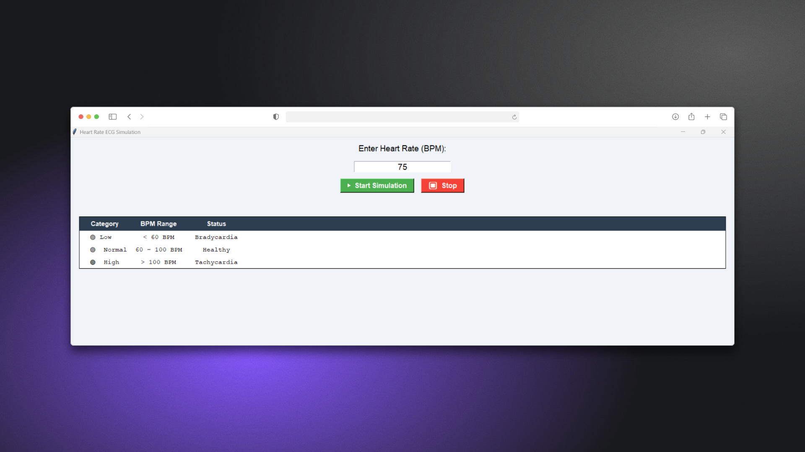
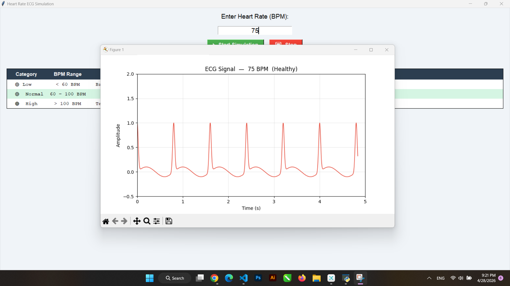
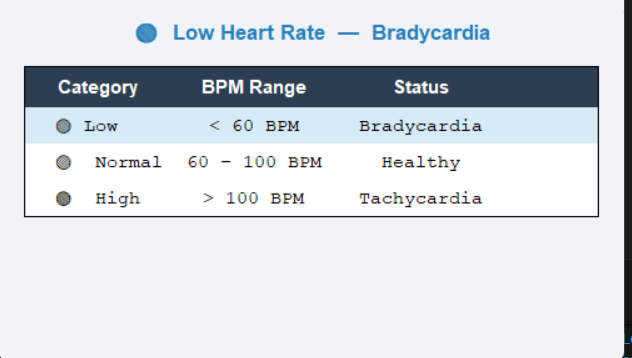
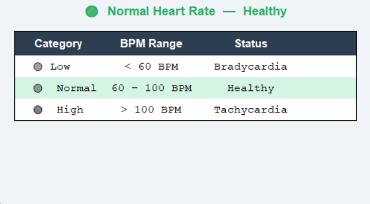
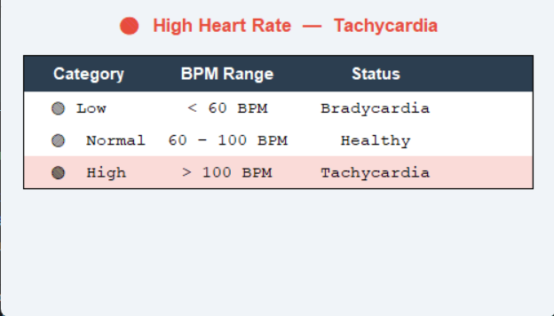

# ❤️ ECG Heart Rate Simulation

## 📌 Overview

The **ECG Heart Rate Simulation** is a desktop application built using **Python**, **Tkinter**, and **Matplotlib**.  
It allows users to simulate an ECG (electrocardiogram) signal based on a given heart rate (BPM) and visualize it in real time.

The application classifies the heart rate into medical categories, highlights the matching row in a built-in classification table, and provides both visual and analytical feedback.

---

## 🚀 Key Features

- ❤️ Real-time ECG signal simulation
- 📊 Dynamic waveform visualization using Matplotlib
- 🔢 User input for heart rate (BPM)
- 🧠 Automatic heart rate classification with medical terminology
- 📋 Built-in classification table with live row highlighting
- ⚡ Smooth animated signal rendering
- 🛑 Start / Stop simulation controls with colored buttons

---

## 🧰 Tech Stack

| Technology | Purpose |
|------------|---------|
| Python | Core language |
| Tkinter | GUI framework |
| NumPy | Signal generation |
| Matplotlib | Waveform visualization |

---

## ⚙️ Getting Started

### 1️⃣ Install Dependencies

```bash
pip install numpy matplotlib
```

### 2️⃣ Run the Application

```bash
python main.py
```

---

## 🧭 How to Use the Application

### 1️⃣ Enter Heart Rate

- Input heart rate in BPM (between **30** and **200**)
- Click **▶ Start Simulation**

<p align="center">
  
</p>

---

### 2️⃣ View ECG Signal

- A real-time ECG waveform is displayed in a separate window
- Signal updates dynamically frame by frame with animation
- The plot title shows the BPM and classification for quick reference

<p align="center">
  
</p>

---

### 3️⃣ Heart Rate Classification

The system automatically classifies the heart rate and:
- **Updates the status label** with emoji, category, and medical term
- **Highlights the matching row** in the classification table

| Category | BPM Range | Status |
|----------|-----------|--------|
| 🔵 Low | < 60 BPM | Bradycardia |
| 🟢 Normal | 60 – 100 BPM | Healthy |
| 🔴 High | > 100 BPM | Tachycardia |

### Low

<p align="center">
  
</p>

### Normal

<p align="center">
  
</p>

### High

<p align="center">
  
</p>

---

### 4️⃣ Stop Simulation

- Click **⏹ Stop** to pause the animation at any time

---

## 🖥️ GUI Overview

The main window includes:

- **BPM input field** — enter your target heart rate
- **▶ Start** (green) / **⏹ Stop** (red) buttons
- **Status label** — displays classification with color and medical term  
  *(e.g. `🔴 High Heart Rate — Tachycardia`)*
- **Classification table** — always visible; active row is highlighted automatically

---

## 📚 What I Learned

- Building GUI applications with **Tkinter**
- Dynamic widget styling and live row highlighting
- Generating and simulating biomedical signals using **NumPy**
- Creating real-time animations with **Matplotlib**
- Handling user input, validation, and error messaging
- Combining visualization with logical classification and medical context

---

## 📌 Future Improvements

- 🎨 Improve GUI design (modern UI / CustomTkinter)
- 📈 Add multiple ECG patterns (e.g. arrhythmia, atrial fibrillation)
- 💾 Save generated signals to CSV or image
- 🧠 More advanced health analysis features
- 🌙 Dark mode support

---

## 📄 License

This project is open-source and available under the [MIT License](LICENSE).
